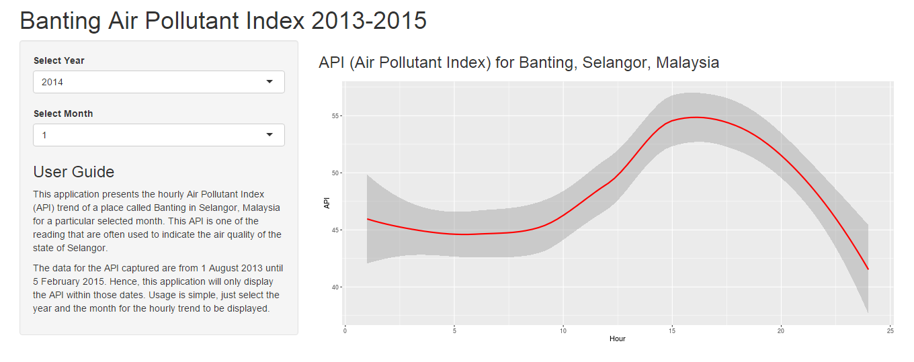

## Introduction

This presentation aims to introduce a Shiny application to allow exploratory data analysis of the hourly Air Pollutant Index (API) trend of a place called Banting in Selangor, Malaysia. API reading from Banting is often used as one of the benchmark to indicate the air quality in the state of Selangor.

---

## Application Description

The API data used for the application are from 1 August 2013 until 5 February 2015. This application can be used to explore the API for a particular month of a year which are selectable and the corresponding hourly trend will be displayed.

This application can be accessed at the following URL:

https://kschin5.shinyapps.io/Banting_API/

---

## Screenshot of the application

<div style='text-align: center;'>
    
</div>

---

## Sample of code used for plotting

```{r echo=FALSE}
# Load ggplot library
library(ggplot2)
library(lubridate)

# Read data source and example of selecting May 2014
banting<-read.csv("D:/R/data_product/API_Banting.csv")
selected.data<-banting[(month(banting$Date)==5 & year(banting$Date)==2014),]
```

```{r echo=TRUE}
ggplot(data=selected.data, aes(x=selected.data$Hour, y=selected.data$API)) +
        geom_smooth(color="red") + labs(x="Hour", y="API")
```
